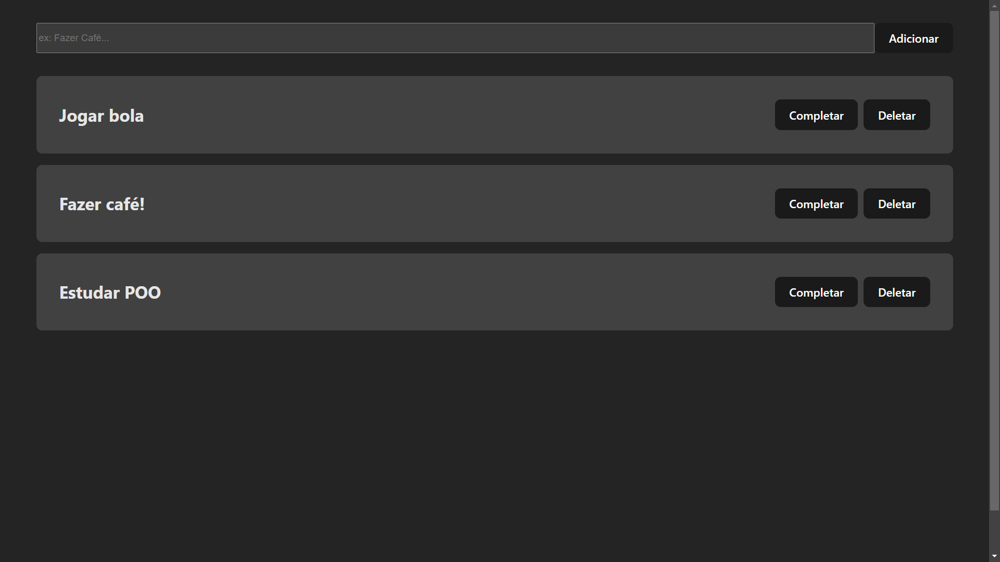

<h1 align="center">TodoList</h1>

TodoList é um marcador de tarefas diárias  

 

  

## 🚀 Tecnologias

Esse projeto foi desenvolvido com as seguintes tecnologias:

- Typescript
- React 
- HTML 
- CSS
- Git e Github
- Vite

## 💻 Projeto

TodoList facilita a marcação de tarefas diárias feita no dia, sendo 100% editável, para melhor experiência do usuário.
- [Visite o projeto online](https://todo-list-ts-mauve.vercel.app/)
